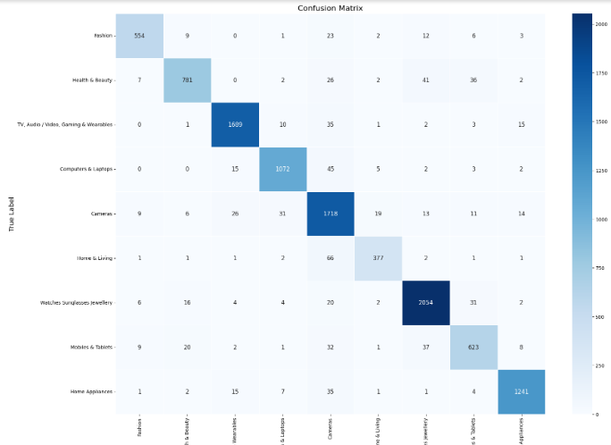

# Product Title Classification

# Information Retrieval Project

##### Syeda Raabia Hashmi k214553

This project involves the preprocessing and classification of a dataset for information retrieval purposes. The main steps include preprocessing, stemming, column filtering, data imputation, and classification using Support Vector Machines (SVM).

## Dataset

The dataset provided ```data_train.csv``` in this project underwent several preprocessing steps. We dropped unnecessary columns and retained only 'category 1', 'category 2', 'category 3', 'title', and 'description'. We then merged the 'title' and 'description' columns and applied further preprocessing.

## Preprocessing

The preprocessing steps included stemming, which is the process of reducing inflected (or sometimes derived) words to their word stem, base or root form. We also used K-Nearest Neighbors Imputation (KNNImpute) to fill in any missing data.

## Classification

We used *_Support Vector Machines (SVM)_* for classification. The data was split into a 70-30 ratio for training and testing respectively.

## Query Processing

Queries were also processed and classified. The similarity between the queried categories and dataset categories showed perfect SVM classification.

## How to Run 

```bash
#Run the given code on Google Colab
#Change path for train_data.csv

```
## Code Outputs



